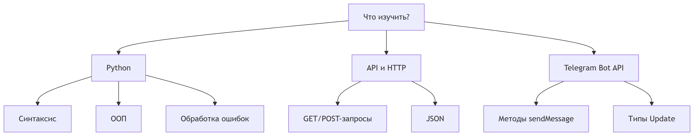
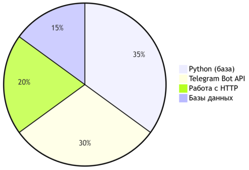
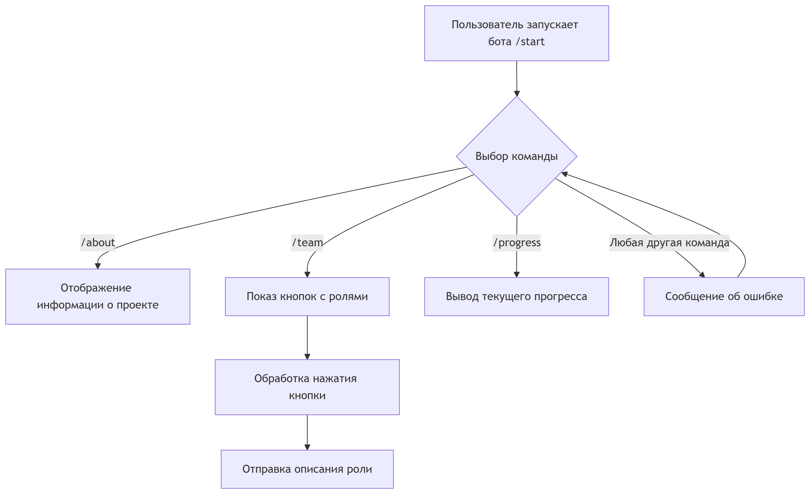
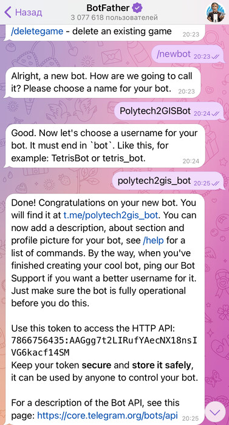

### Техническое руководство по созданию телеграмм-бота о проекте "Автоматизация внутренних бизнес-процессов университета. 2ГИС"

## Введение

Телеграмм-бот "Polytech2GISBot" преднозначен для ознакомления студентов и преподавателей с проектом "Автоматизация внутренних бизнес-процессов университета. 2ГИС"
Бот предоставляет:
1. Подробную информацию о проекте и его важности
2. Знакомство с командой проекта
3. Описание обязанностей каждого студента
4. Информацию о текущем прогрессе
5. Контакты

## Этап изучения 

Перед созданием бота необходимо изучить:
1. Основы Python
2. Принципы работа API
3. Специфику Telegram Bot API
   

Материалы для изучения:
1. https://www.freecodecamp.org/news/how-to-create-a-telegram-bot-using-python/
2. https://core.telegram.org/bots/api

## Архитектура проекта

Командный модуль:
* /start - инициализация бота
* /about - информация о проекте
* /team - участники проекта
* /tasks - распределение задач
* /progress - текущий прогресс
* /contacts - контакты команды
  
## Этапы разработки бота

1. Установка Python (3.8+) и библиотеки
> pip install python-telegram-bot  
2. Создание бота в @BotFather и получение токена

