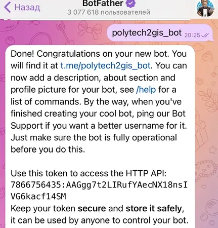

### Техническое руководство по созданию телеграмм-бота о проекте "Автоматизация внутренних бизнес-процессов университета. 2ГИС"

## Введение

Телеграмм-бот "Polytech2GISBot" преднозначен для ознакомления студентов и преподавателей с проектом "Автоматизация внутренних бизнес-процессов университета. 2ГИС"
Бот предоставляет:
1. Подробную информацию о проекте и его важности
2. Знакомство с командой проекта
3. Описание обязанностей каждого студента
4. Информацию о текущем прогрессе
5. Контакты

## Этап изучения 

Перед созданием бота необходимо изучить:
1. Основы Python
2. Принципы работа API
3. Специфику Telegram Bot API
   

Материалы для изучения:
1. https://www.freecodecamp.org/news/how-to-create-a-telegram-bot-using-python/
2. https://core.telegram.org/bots/api

## Архитектура проекта

Командный модуль:
* /start - инициализация бота
* /about - информация о проекте
* /team - участники проекта
* /tasks - распределение задач
* /progress - текущий прогресс
* /contacts - контакты команды
  
## Этапы разработки бота

1. Установка Python (3.8+) и библиотеки
> pip install python-telegram-bot  
2. Создание бота в @BotFather и получение токена

3. Создать файл main.py и добавить **базовый код**
>from telegram import Update, InlineKeyboardButton, InlineKeyboardMarkup 
from telegram.ext import ( 
    ApplicationBuilder, 
    CommandHandler, 
    MessageHandler, 
    CallbackQueryHandler, 
    ContextTypes, 
    filters 
) 
logging.basicConfig( 
    format="%(asctime)s - %(name)s - %(levelname)s - %(message)s", 
    level=logging.INFO 
)
logger = logging.getLogger(__name__) 
TOKEN = "7866756435:AAGgg7t2LIRufYAecNX18nsIVG6kacf14SM" 
4. Добавление базового функционала

**Команда /about**
> async def about(update: Update, context: ContextTypes.DEFAULT_TYPE) -> None: 
    await update.message.reply_text( 
        "📌 *О проекте:*\n\n" 
        "Наш проект создан для удобства студентов и преподавателей Московского Политеха.\n" 
        "Мы делаем замеры аудиторий и коридоров всех корпусов, чтобы перенести их в 3D и добавить в 2ГИС.\n\n" 
        "🔹 *Цель:*\n" 
        "Создать детализированную карту университета, чтобы любой человек мог быстро найти нужную аудиторию.\n\n" 
        "🔹 *Как это работает?*\n" 
        "1️⃣ Студенты делают замеры помещений\n" 
        "2️⃣ Данные переносятся в 3D-модель\n" 
        "3️⃣ Готовая модель интегрируется в 2ГИС\n\n" 
        "📌 Проект реализуется силами студентов 1 курса.", 
        parse_mode="Markdown" 
    ) 

**Обработака нажатий**
>async def button_handler(update: Update, context: ContextTypes.DEFAULT_TYPE): 
    query = update.callback_query 
    if query.data == "leader": 
        await query.edit_message_text("💼 Лидер: Алина") 
        
**Обработчик ошибок**
> async def unknown(update: Update, context: ContextTypes.DEFAULT_TYPE): 
    await update.message.reply_text( 
        "Извините, такой команды нет. Попробуйте /contacts", 
        parse_mode="Markdown" 
    ) 

**Запуск бота**
> def main(): 
    application = ApplicationBuilder().token(TOKEN).build() 
    application.add_handler(CommandHandler("start", start)) 
    application.run_polling() 

    
